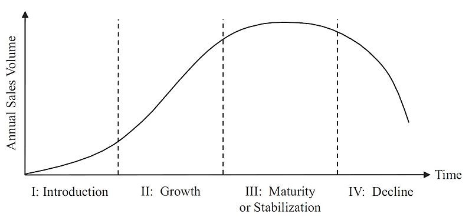
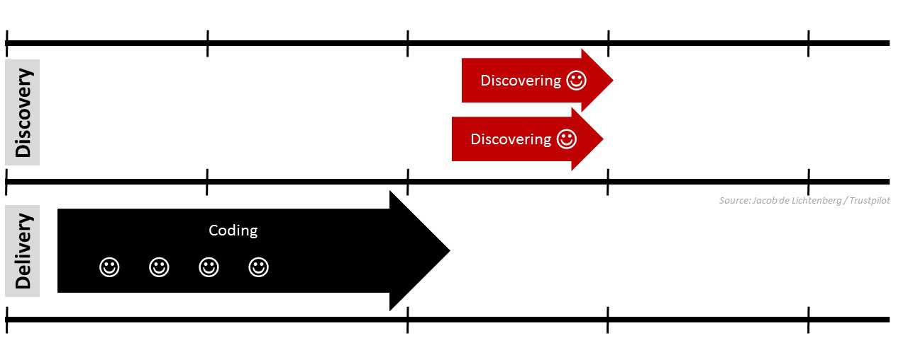

Building products with a lean approach is more successful because you’re not risking everything on a potentially long, slow-to-create project. Instead, you risk a little bit to build something small, learn from it, and iterate.

> A product isn’t a collection of features; it’s an experience from the first touchpoint to the very end.

{::options parse_block_html="true" /}

### On this section
1. [Product Development Process](#product-development-process)
2. [Phases of the product lifecycle](#phases-of-the-product-lifecycle)
3. [What is Agile?](#what-is-agile)
4. [What is Lean?](#what-is-lean)
5. [What is Design Thinking?](#what-is-design-thinking)
6. [Dual Track Agile](#dual-track-agile)
7. [Project Management](#project-management)
	- [Scrum: A structured agile approach](#scrum-a-structured-agile-approach)
	- [Kanban: Continuous improvement, flexible processes](#kanban-continuous-improvement-flexible-processes)
	- [Waterfall Development](#waterfall-development)

## Product Development Process

1. **Conceive**: Collect user problems and brainstorm possible solutions.
2. **Plan**: Market research, exploratory interview, roadmapping.
3. **Develop**: User stories, specs, start the MVP.
4. **Iterate**: We test the assumptions.
5. **Launch**: Work with Marketing, Sales. Go To Market Strategy.
6. **Steady state**: Connecting metrics, analyze user feedback.
7. **Maintain or Kill**: Can we compete? How frequently users use it? How much money are we spending to maintain it

## Phases of the product lifecycle

[From Interaction Design article. Resources section.](#resources)

The product life-cycle is a great tool for marketers, product managers and designers. The four individual stages of a product’s life offer guidance for developing strategies to make the best use of those stages. It's also built based on the following assumptions.

1. Products have a limited life span
2. Each phase of the life cycle presents opportunities and challenges to take advantage of and to overcome.
3. Products will require different efforts from design, development, marketing, purchasing, etc. during each phase

## What is Agile?

The concept of Agile came out of frustration at the way software was delivered. A group of engineers who were looking for a better way of working came together to create the [Agile Manifesto](https://agilemanifesto.org/). At its core, the Agile Manifesto is not about process – it doesn’t dictate how to work. It is a philosophy of working.

## What is Lean?

Lean encourages a pull model – looking for signals from the market about what and how much should be built, and then only building that amount. In order to do this, Lean empowers the people closest to the work to make the most critical decision and  looks at businesses as “Grand Experiments”, focusing on answering the question: “Should we build this?”

Lean relies on two important principles:

- You can’t predict the future, so you are always moving from doubt to certainty
- To reduce the risk of moving too far the wrong path, we work in small batches, then pause and learn

## What is Design Thinking?

Design Thinking focuses on empathizing with the people whose problems you are trying to solve, understanding the landscape, ideating solutions, prototyping, and testing to see if you are moving in the right direction. When done well, Design Thinking fits nicely into the Lean Startup “Build – Measure – Learn” loop. These can then flow into Agile.

## Dual-Track Agile

Dual-Track Agile is a methodology where figuring out *what* to build is as important as the building process. You start with a discovery track to find out if a product idea is good and if it makes sense to build. Successful findings from the discovery track are added to the backlog of the delivery track, which is the most familiar scenario for product managers.

[From Jacob Litchenberg article. Resources section](#resources)

The purpose of the discovery track is to work out if a product idea makes sense to build. During the discovery process, the product team should collect answers to the following four questions:

- Will users use it? (Value)
- Can users use it? (Usability)
- Can we build it? (Effort)
- Can we get internal support? (Stakeholders)

Dual-Track Agile raises complexity in many areas, especially when it comes to planning and resource allocation. The objective is outcome based (e.g. increase leads) rather than delivery based (e.g. build a specific feature). 

Outcome-based objectives are fundamental to Dual-Track Agile product development.

## Project Management

While these methodologies, frameworks, and techniques have significant differences, it’s important to acknowledge that each project management methodology ultimately has the same goal: to facilitate the completion of projects.

### Scrum: A structured agile approach

Scrum teams commit to ship working software through set intervals called sprints. Their goal is to create learning loops to quickly gather and integrate customer feedback. Scrum teams adopt specific roles, create special artifacts, and hold regular ceremonies to keep things moving forward. Scrum is best defined in [The Scrum Guide](https://www.scrumguides.org/scrum-guide.html).

### Kanban: Continuous improvement, flexible processes

Kanban is all about visualizing your work, limiting work in progress, and maximizing efficiency (or flow). Kanban teams focus on reducing the time it takes to take a project(or user story) from start to finish. They do this by using a kanban board and continuously improving their flow of work.

### Waterfall Development

Waterfall works best for projects completed in a linear fashion and does not allow going back to a prior phase. Waterfall project management is a relatively old methodology that works best for projects completed in a linear fashion. As such, Waterfall has two unique traits:

- Discrete, terminal phases: You must complete each stage before the next stage can begin
- Thorough documentation: This methodology begins with gathering and documenting requirements

---

This is a first draft and a just a glance of what Product Development is. Take the time to learn from the resources below. We keep them up to date!

Do you have any feedback? Please, let us know [here]().

## Resources

||["How to Use the Product-Life Cycle" by Interaction Design](https://www.interaction-design.org/literature/article/how-to-use-the-product-life-cycle)|4 min read|

||["What is Dual Track Agile?" by Jacob De Lichtenberg](https://www.mindtheproduct.com/2017/04/dual-track-agile-messy-leads-innovation/)|12 min read|

||["Lean, Agile, & Design Thinking" by Emily Tate](https://www.mindtheproduct.com/2019/06/lean-agile-design-thinking-by-jeff-gothelf/)|4 min read|

||["Kanban vs. Scrum" by Max Rehkopf](https://www.atlassian.com/agile/kanban/kanban-vs-scrum)|8 min read|

||["Agile vs. Waterfall vs. Kanban vs. Scrum: What’s the Difference?" by Lucidchart](https://www.lucidchart.com/blog/agile-vs-waterfall-vs-kanban-vs-scrum)|8 min read|
