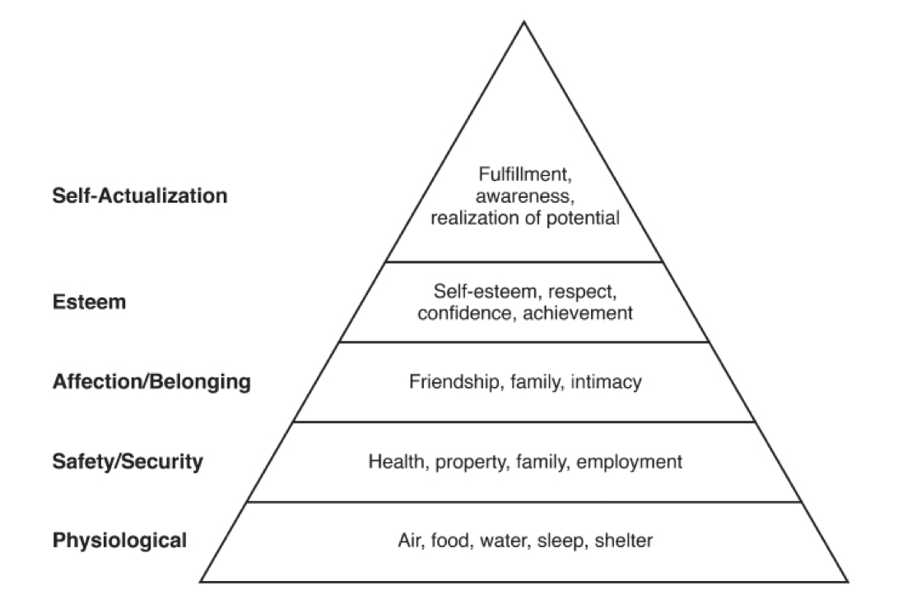

Product Management is about finding a solution to a problem instead of trying to fit a problem to a solution. A problem represents one or more needs of the target customer.

Finding customer needs can be challenging. Sometimes they don't reveal them in a clear way during interviews or they are just not fully aware of them.

It is the job of a Product Manager to build up and validate the knowledge about the problem space so far. The way to get there is by carefully listening to what customers say and observing what they do.

{::options parse_block_html="true" /}

### On this section
- [Identify Customer Needs](#identify-customer-needs)
- [Understand Customer Needs](#understand-customer-needs)
- [Needs Hierarchy](#needs-hierarchy)
- [Feature Requests and Ideas](#feature-requests-and-ideas)
	- [Where Ideas Come From](#where-ideas-come-from)

## Identify Customer Needs

Customer needs have many ways to describe them. People often call them customer benefits, desires or wants, pain points or user goals. Yet what they all have in common is that they communicate customer's perspective.

Customers have a hard time talking about their needs. They hide them. Product Managers need to read between lines to get these unmentioned needs. Also, unknown needs can be hiding too. Sometimes customers don’t realize an existing need until they talk about it.

User interviews are the perfect tool to get customer needs. They help to better understand the problem space.

## Understand Customer Needs

Discovery interviews help Product Managers to learn how clear the customer benefits are. They try to validate the hypothesis about the target customer by asking questions.

Customers can use different ways to describe the same idea. The will use different jargon or level of detail. But after a while, how customers think and what's important to them becomes obvious.

> Winning products come from the deep understanding of the user’s needs combined with an equally deep understanding of what’s just now possible - Mary Cagan

## Needs Hierarchy

Another interesting thing about customer needs is that they usually have hierarchies. This increases complexity when addressing them  since dependencies may exist. Another reason why exploring the problem space is so important.

The most common example of this is Abraham Maslow's hierarchy of human needs:

[From Dan Olsen's book. Resources section.](#resources)

Product Managers need to know that higher level needs don't  matter to customers if they don't meet the more basic needs first.

## Feature Requests and Ideas

Most of the time, Product Managers will get a list of ideas or feature requests from stakeholders. The biggest mistake they can make is go and start building them.

First of all, they need to understand what's the real problem behind them. There is an old technique that salespeople use: Asking why. The goal is to keep asking until the root cause of the problem emerges.

Second, they need to take a hard look at the idea and decide if it is something worth pursuing. A good idea may not be a good fit now until later in the roadmap.

### Where Ideas Come From

New ideas come from anywhere at the company. From executives, customers, internal teams, sales or marketing staff to industry reports. 

Despite popular belief, Product Management job is not about being the "idea person". They know more than anyone what's possible and what's important for the customer. Their job is to use all inputs and act upon them.

The four main places where ideas come from are:

* **Employees**: Ideas coming from your coworkers, management, and yourself.
* **Metrics**: Problems and inefficiencies you find when looking how users use your product.
* **Users**: User feedback from forums, chats and emails
* **Clients**: Functionality required from the people who pay the product.

Product Mangers need to learn to say no and manage expectations. But at the same time, they need collaboration from these places to create a winning product.

---

This is a first draft and a just a glance of where ideas come from. Take the time to learn from the resources below. We keep them up to date!

Do you have any feedback? Please, let us know [here]().

## Resources

||["Product Discovery" by Marty Cagan](https://svpg.com/product-discovery/)|5 min read|
||["User vs. Customer: Does It Matter?" by Kate Kiefer Lee](https://www.forbes.com/sites/katelee/2012/10/18/user-vs-customer-does-it-matter/#3ce2781b5dcd)|2 min read|
||["A Practical Guide to User Needs" by Julia Mitelman](https://medium.com/on-products/a-practical-guide-to-user-needs-89a1e0c03f95#.k364mfz7q)|12 min read|
||["Inspired: How To Create Products Customers Love" by Marty Cagan, Chapters 1-3](https://www.amazon.com/Inspired-Create-Products-Customers-Love/dp/0981690408/)|
||["The Lean Product Playbook" by Dan Olsen, Chapter 4](https://www.amazon.com/Lean-Product-Playbook-Innovate-Products/dp/1118960874/)|