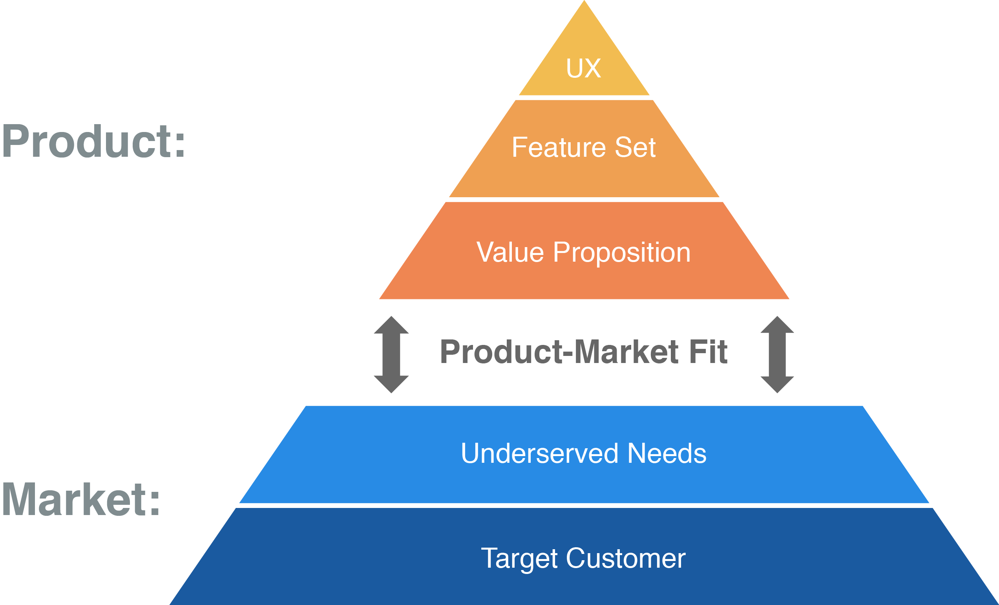

We all know examples of failed products and companies. The main reason is because they don't meet customer needs better than the current alternatives or [Product-Market Fit](https://en.wikipedia.org/wiki/Product/market_fit). Their focus was on the specific implementation of the product or solution space rather than the problem . Check the [space pen problem](https://history.nasa.gov/spacepen.html).

Product Managers, need to know which customer needs will their product solve. These unserved needs for a target customer are the market. They can target those needs but not change or control them. This is the problem space.

They best way to mitigate "solution pollution" is by mastering the problem space before anything else.

{::options parse_block_html="true" /}

### On this section
1. [Problem space vs. Solution space](#problem-space-vs-solution-space)
2. [The Product/Market Fit Pyramid?](#the-product-market-fit-pyramid)
3. [Assesing Product Opportunities (POA)](#assessing-product-opportunities-poa)
	- [The fundamental questions](#the-fundamental-questions)

## Problem space vs. Solution space

The problem space is where the customer needs of your target customer lives. These can be anything from pain points, desires, or jobs-to-be-done. They define markets segments.

The solution space is any specific implementation to build a product. They can be any product or representation of product built for customer use.

> Customers don’t care about your solution. They care about their problems - Dave McClure

Experience says customers are not likely to communicate their needs clearly. It's not how the human brain works. We have a natural tendency to think in terms of solutions.

The job of Product Managers is to read between lines in the solution space to define the problem space.

## The Product/Market Fit Pyramid

Marc Andreesen coined the term Product/Market Fit as "being in a good market with a product that can satisfy that market." in a well-known [blog post](https://pmarchive.com/guide_to_startups_part4.html).

But this doesn't say much about how to get there. That's why Dan Olsen created a framework called "Product/Market Fit Pyramid".

This framework separates the key components in 5 layers. Each layer depends on the layer immediately beneath it. Each layer is a hypothesis you need to confirm before moving up:

[From Dan Olsen's book. Resources section.](#resources)

1. **Target Customer**: Who are they?
2. **Underserved Needs**: What are their needs?
3. **Value Proposition**: How the customer benefits and how the product is better
4. **Feature Set**: The functionality that supports those benefits
5. **User Experience (UX)**: What the customer interacts with to get the benefits

> Fall in love with the problem not the solution, and the rest will follow - Uri Levine

The first three live in problem space. The other two are what customers see and interact with and live in the solution space.
The biggest pitfall is to get stuck here. Product Managers need to make sure their work ties back to solving a real customer problem.

## Assesing Product Opportunities (POA)

The purpose of a good product opportunity Assessment (POA) is to either:

- Prevent the company from wasting time and money
- Understand and define success

What is possible is always changing. That's why opportunities for new products exist. Sometimes good opportunities are not ready for productization just yet.

This process help Product Managers to evaluate if an opportunity is promising or not. The real challenge is find a way to this quick and effective:

### The ten fundamental questions 

1. Exactly what problem will this solve? (value proposition) 
2. For whom do we solve that problem? (target market) 
3. How big is the opportunity? (market size) 
4. How will we measure success? (metrics/revenue strategy) 
5. What alternatives are out there now? (competitive landscape) 
6. Why are we best suited to pursue this? (our differentiator) 
7. Why now? (market window) 
8. How will we get this product to market? (go-to-market strategy) 
9. What factors are critical to success? (solution requirements) 
10. Given the above, what’s the recommendation? (go or no-go)

The hardest questions to answer are the first and the third. Product Managers need to have a compelling statement of the problem they are trying to solve and its size.

---

This is a first draft and a just a glance of what Product/Market Fit means. Take the time to learn from the resources below. We keep them up to date!

Do you have any feedback? Please, let us know [here]().

## Resources

||["Inspired: How To Create Products Customers Love" by Marty Cagan, Chapters 1-3](https://www.amazon.com/Inspired-Create-Products-Customers-Love/dp/0981690408/)|

||["The Lean Product Playbook" by Dan Olsen, Chapters 1-2](https://www.amazon.com/Lean-Product-Playbook-Innovate-Products/dp/1118960874/)|

||["Mastering the problem space" by Martin Eriksson](https://www.mindtheproduct.com/2018/08/mastering-the-problem-space-for-product-market-fit-by-dan-olsen/)|4 min read|

||["Assessing Product Opportunities" by Marty Cagan](https://svpg.com/assessing-product-opportunities/)|5 min read|
