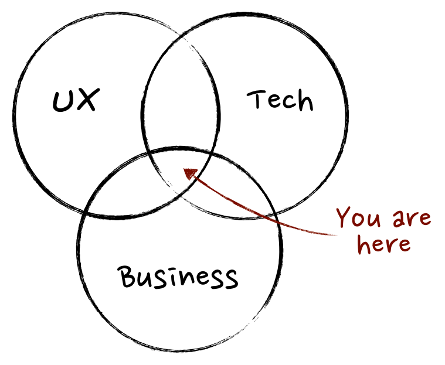

In todays tech industry, great Product Management is not longer optional. What it used to be a competitive advantage now is a must-do for all companies that want to stay competitive.

Product Management is all about building the right product. How to build the product right is important, but if your customers don't care about your product it doesn't matter.

Moreover, the role of a Product Manager is still vague. The nature of the role makes it hard for companies and industries to find a common ground.

{::options parse_block_html="true" /}

### On this section
- [What is a Product Manager?](#what-is-a-product-manager)
  - [Business](#business)
  - [Technology](#technology)
  - [User Experience](#user-experience)
- [What they do?](#what-they-do)
- [Product Manager vs. Project Manager](#product-manager-vs-project-manager)
- [Product Manager vs. Product Marketing Manager](#product-manager-vs-product-marketing-manager)
- [Types of Product Managers](#types-of-product-managers)
  - [Internal Product Manager](#internal-product-manager)
  - [Business to Business Product Manager](#business-to-business-product-manager)
  - [Busines to Consumer Product Manager](#business-to-consumer-product-manager)

## What is a Product Manager?

Product managers are responsible for the ultimate success of the product. They are like the conductor in an orchestra. The conductor helps the orchestra to deliver a great performance to the audience.

> To discover a product that is valuable, usable and feasible - Marty Cagan

Product managers don't manage people. They need to lead the team without authority. They pull all the pieces together by getting feedback from everyone else.

Think about Product Management as the intersection between business, technology and user experience:

[From Martin Eriksson’s article. Resources section.](#resources)

#### Business
Product Managers achieve business goals while maximising return on investment (ROI). This is why product optimization is so important.

#### Technology
Product Managers understand the trade-offs during product implementation. This is why knowing the tech stack is so important.

#### User Experience

Product Managers understand that people think in terms of conceptual models. This is why talking to users and getting feedback first hand is so important.

A good Product Manager needs to feel comfortable with all three, no matter what their background is.

## What they do?

Product Managers have two key responsibilities. They decide which opportunities are worthy and define the product to build.

But, where to start?

Product Managers start by setting the vision for the product. To do so, they need to research the market, the customer and the problem they are trying to solve. They learn all they can to come up with a vision for the product. Depending on the organization, this could be a team effort.

After the vision is set, Product Managers switch to evangelist mode. Everyone at the company needs to understand the vision. It's their job to communicate the vision clearly. This is fundamental to the success of the product.

Then, Product Managers work on the product strategy. This is how the team is going to reach out that vision. During product development, challenges will come up. The strategy is the map they use to get the right product out on time.

Once the product is out, Product Managers need to know how customers are using the product. They look for ways to improve the product by going out and talking to customers.

This is what they do, over and over again.

## Product Manager vs. Project Manager

This is the most common confusion. Project managers are responsible for accomplishing the project. A project usually has a timeline and a budget as a constraint.

Product Managers are responsible for the success of the product, which is measured by key performance indicators (KPIs). However, they need the skill of project management to manage product releases.

## Product Manager vs. Product Marketing Manager

Product Marketing Managers are responsible for telling the world about that product. This include positioning, messaging and pricing and managing product launches. They also provide tools for selling the product and leading marketing programs.

Product managers are responsible for validating the product with real customers and users.

They both need to work very closely, especially, during product launches.

## Types of Product Managers

A common way to classify Product Managers is stakeholders relationship. Stakeholders are the people that have input on the product.

The different types are:

### Internal Product Manager

The internal Product Manager is one of the best introduction role.  They are in charge of building internal tools for the company they work for.

This is a great opportunity to learn a lot about technology and do a lot of project management.

The number of users is often small, so the risk is lower.

### Business to Business Product Manager

This is another introduction role. Their goals are influenced by marketing and sales. Their focus is on tight deadlines and revenue.

The number of users is also small, but they are not the customer. This is a good opportunity to get creative.

### Business to Consumer Product Manager

The is the most challenging role. The level of uncertainty and pressure is high since the company can lose money on any misstep.

This a great opportunity to learn, especially doing user testing.

The number of users is often high, so the risk is higher.

---

This is a first draft and a just a glance of what Product Management is. Take the time to learn from the resources below. We keep them up to date!

Do you have any feedback? Please, let us know [here]().

## Resources

||["What, exactly, is a Product Manager" by Martin Eriksson](https://www.mindtheproduct.com/2011/10/what-exactly-is-a-product-manager/)|4 min read|
||["What is a product manager and what do they do?" by Geoffrey Keating](https://www.intercom.com/blog/qa-what-does-a-product-manager-do/)|4 min read|
||["Inspired: How To Create Products Customers Love" by Marty Cagan, Chapters 1-3](https://www.amazon.com/Inspired-Create-Products-Customers-Love/dp/0981690408/ref=sr_1_5)|
