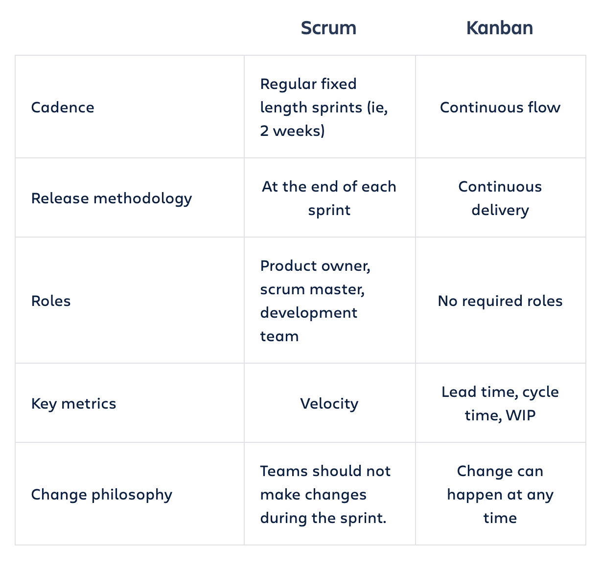
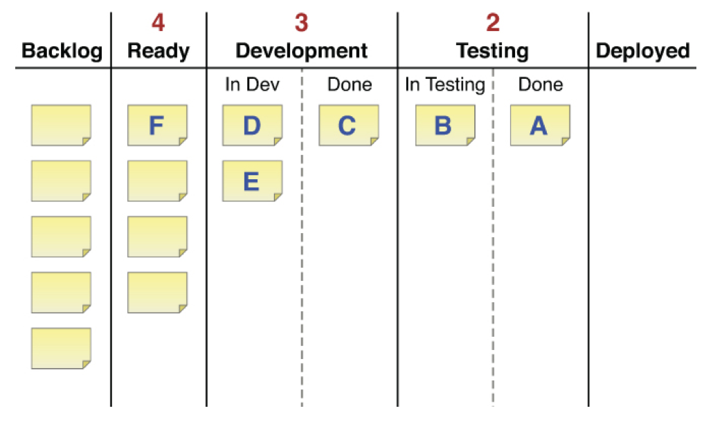

When it comes to building a product, solid execution is everything. As a Product Manager, your goal is to build what you promise during the MVP tests phase. The development team is going to build a full product using these learnings as input.

During execution, many risks could prevent your team from launching the product. Technical issues, lack of resources and tight deadlines may affect the quality of the final product.

Your job as Product Manager is to make sure the product your customers are expecting comes out of the door.

Depending on the product, a good practice is to use *Agile* Development. An incremental and iterative approach that allows your team to learn and adapt.

{::options parse_block_html="true" /}

### On this section
- [What is Agile?](#what-is-agile)
	- [The Challenges of Agile](#the-challenges-of-agile)
- [Scrum vs Kanban](#scrum-vs-kanban)
	- [Scrum: A structured approach](#scrum-a-structured-agile-approach)
	- [Kanban: A flexible approach](#kanban-a-flexible-approach)
- [Dual-Track Agile](#dual-track-agile)
- [What is Waterfall Development?](#what-is-waterfall-development)

## What is Agile Development?

Agile is often used to describe a set of product development methodologies but is actually a set of ideas and principles. There are 12 principles of Agile Software described in the [Agile Manifesto](https://agilemanifesto.org/) that explains the working philosophy:

- **Individuals and interactions** over processes and tools.
- **Working software** over comprehensive documentation.
- **Customer collaboration** over contract negotiation.
- **Responding to change** over following a plan.

The concept of Agile is to reduce risk by breaking down projects into small iterations and build incrementally. On each iteration, the team learns and adapt the product based on customer feedback. It is all about producing working software and uses it as a measure of progress.

The ultimate goal of Agile is to deliver valuable software that customers want faster and more efficient, not just any software.

> Using Agile is not an excuse for a lack of product planning - Marty Cagan

Today, Agile is common for most companies. No one wants to spend months or years to launch a product, especially in the tech industry. However, mastering Agile is not easy.

### The Challenges of Agile

Over the years, Agile has generated passionate debates. In practice, adopting Agile is very challenging. Some companies have misunderstood the principles along with what Agile can actually do.

Agile methodologies serve as a catalyst for continuous improvement. That means that if a company doesn't have this *mindset* in place, implementing Agile can even make the situation more frustrating.

Here is a list of things that a company needs to invest energy in order to benefit from Agile methodologies:

- Doing meaningful work. Outcomes, not output.
- An infrastructure that allows teams to ship autonomously.
- A management culture biased to learning and action.
- A clear north star and how to get there. A vision and strategy in place.
- Feeling comfortable with complexity and uncertainty.

Agile is not a silver bullet. It requires a great deal of commitment and energy.

## Scrum vs. Kanban

The most popular Agile methodologies are Scrum and Kanban. While these frameworks have differences, they share most of the Agile principles. They also have the same goal: to facilitate the completion of projects.

Kanban works best with smaller teams since it's the most flexible in terms of implementation. The goal is to reduce the work in progress and improve the workflow as much as possible.

Scrum allows to some predictability with time-boxed increments and deliverables. This structure helps to make high-level estimations on how long a project would take.

[From A Max Rehkopf's article. Resources section.](#resources)

Companies can benefit from both. A good approach is to choose the best fit and stick with it for a while. Then, ask your team what went well and what could improve. If necessary, switch to another methodology.

The final decision doesn't need to be binary. Many teams are using hybrid models with a mix of both. Use what is best for your team.

### Scrum: A structured approach

Scrum teams ship working software by the end of each time-boxed iteration. These are called sprints. They act as learning loops that allow integrating customer feedback on each time.

Sprints length may vary but the most common is two weeks. This short period forces the team to tackle small chunks of work. By doing it, they reduce the estimation errors, deliver faster and learn more quickly.

[From Dan Olsen's book. Resources section.](#resources)

Scrum uses a set of ceremonies on each sprint plan, review and learn. These are *sprint planning*, *sprint review* and *retrospective* meetings. There is also a short *daily standup* meeting to discuss any potential blocker and helps keep the team to be in sync.

During the sprint planning, the team creates a backlog of *user stories*. A user story is a reflection of a customer need. This backlog is what the team commits to deliver by the end of the sprint. Sometimes releases may happen ad-hoc. The focus is on not changing the scope of the sprint unless is unavoidable.

The most important metric is the number of story points completed in a sprint. Over time, the average of story points completed on each sprint helps the team calculate its velocity. The longer the team has worked together, the more accurate this metric is. This is how the team knows how much they can commit on a sprint. 

Scrum's roles, artifacts, and rules are best defined in [The Scrum Guide](https://www.scrumguides.org/scrum-guide.html).

### Kanban: A flexible approach

Kanban is a board that helps visualize your work. The board has different stages based on your workflow. This helps the team to be on the same page and identify issues as they arise. Kanban is great for teams that have changing priorities and lots of requests.

[From Dan Olsen's book. Resources section.](#resources)

Every work item on the board is a Kanban card. A team member chooses a card to work on, then moves it from left to right following the workflow, until is done. Kanban does not have a regular schedule to release updates.

The team focuses on limiting the work in progress and lower the time that takes a card to get finished. These are the most important metrics.

The work-in-progress limit is great for dealing with bottlenecks. The team chooses a limit to the number of cards in progress and avoid starting a new card until a task is done. They also track the time it takes to complete a card. This requires a good amount of discipline and collaboration.

The goal of Kanban is to continuously improve the workflow. The team meets on a regular basis to discuss where is room for improvement. The whole team is responsible, not a single person.

## Dual-Track Agile

The concept of this Dual-track Agile is that *what* to build is as important as *how* to build it. It requires a certain level of experience working with Agile since it can get messy very fast.

There are two tracks running in parallel. The discovery track and the delivery track. The first test if a product idea is good and makes sense to build. Any method to run experiments will do it. The experimental approach used in MVP tests is the most common and effective. Then, the validated ideas move to the delivery track, which is the usual backlog in Agile methodologies. Both Scrum and Kanban can be used here.

[From Jacob Litchenberg article. Resources section](#resources)

For every product idea, the product team should collect answers to the following questions:
- How much value does create?
- How easy is to use?
- How much effort does it take?
- What risks and concerns stakeholders have?

Dual-Track Agile raises complexity in many areas. Especially in planning and resource management. The team and the company need to have solid Agile foundations before even trying it.

The focus on outcomes becomes explicit using Dual-Track Agile.

## What is Waterfall Development?

Before the massive adoption of Agile, software was created using *Waterfall* development. This methodology works with a series of sequential stages.

[From Lucidchart's article. Resources section.](#resources)

The idea is to complete each stage before moving to the next one. This means no design until requirements are defined and no coding until the product is designed. Also, you can't go back to a previous stage without starting the process again. This lack of flexibility is the main reason why most companies move to Agile.

Documentation is key for *Waterfall*. The team begins gathering and documenting requirements. Then, documenting their work through each phase of design, implementation, and testing. This facilitates the on-boarding of new team members, different teams and different locations.

The focus on linear completion has its origins in the manufacturing and construction industries. For certain projects, *Waterfall* is a better approach. This is especially true when the risk or cost of failure is too high.

---

This is a first draft and a just a glance of what Product Development is. Take the time to learn from the resources below. We keep them up to date!

Do you have any feedback? Please, let us know [here](https://forms.gle/8VSU94ehuD1EBGG46).

## Resources

||["What is Dual Track Agile?" by Jacob De Lichtenberg](https://www.mindtheproduct.com/2017/04/dual-track-agile-messy-leads-innovation/)|12 min read|
||["Kanban vs. Scrum" by Max Rehkopf](https://www.atlassian.com/agile/kanban/kanban-vs-scrum)|8 min read|
||["Agile vs. Waterfall vs. Kanban vs. Scrum: What’s the Difference?" by Lucidchart](https://www.lucidchart.com/blog/agile-vs-waterfall-vs-kanban-vs-scrum)|8 min read|
||["Why isn't Agile working?" by John Cutler](https://medium.com/hackernoon/why-isnt-agile-working-d7127af1c552)|4 min read|
||["Inspired: How To Create Products Customers Love" by Marty Cagan, Chapters 12, 26](https://www.amazon.com/Inspired-Create-Products-Customers-Love/dp/0981690408/)|
||["The Lean Product Playbook" by Dan Olsen, Chapter 12](https://www.amazon.com/Lean-Product-Playbook-Innovate-Products/dp/1118960874/)|